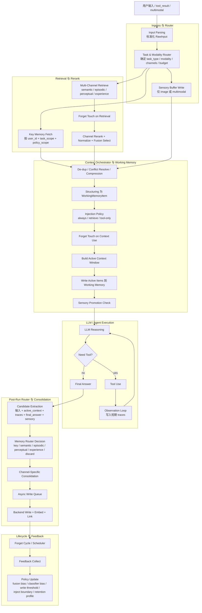

# CogniWeave 分层框架开发指南

> 警告：后续任何 agent 在基于本框架开发功能前，必须先完整阅读本文档。
>
> 核心原则只有一句：把模型当成傻子教，不允许猜，不允许自作主张，不允许偷改框架源码。

---

## 目录

1. [先记住这三条铁律](#1-先记住这三条铁律)
2. [这份文档是写给谁的](#2-这份文档是写给谁的)
3. [项目根目录与禁止修改区域](#3-项目根目录与禁止修改区域)
4. [开始写任何代码之前必须做的事](#4-开始写任何代码之前必须做的事)
5. [推荐的上下文获取策略混合策略](#5-推荐的上下文获取策略混合策略)
6. [框架当前提供了什么能力](#6-框架当前提供了什么能力)
7. [哪些事可以做哪些事绝对不能做](#7-哪些事可以做哪些事绝对不能做)
8. [如果用户要的新功能框架做不到怎么办](#8-如果用户要的新功能框架做不到怎么办)
9. [标准开发流程必须按顺序执行](#9-标准开发流程必须按顺序执行)
10. [标准导入模板必须照抄](#10-标准导入模板必须照抄)
11. [核心 API 速查与最小示例](#11-核心-api-速查与最小示例)
12. [最常见的开发场景示例](#12-最常见的开发场景示例)
13. [错误示例与正确示例](#13-错误示例与正确示例)
14. [框架改动需求文档模板必须使用](#14-框架改动需求文档模板必须使用)
15. [写完后必须做的自审](#15-写完后必须做的自审)
16. [快速检查清单](#16-快速检查清单)
17. [常用命令](#17-常用命令)

---

## 1. 先记住这三条铁律

### 铁律 1：绝对不能修改框架源码

禁止修改：

- `cogniweave_full/`
- `cogniweave_full/core/`
- `cogniweave_full/memory/`
- `cogniweave_full/tools/`
- `cogniweave_full/agents/`

只要用户要求的是“基于这个框架开发 app / demo / 新功能 / 测试 / 验证脚本”，你的工作区就应该放在框架外部，例如：

- `apps/`
- `examples/`
- `playground/`
- 用户指定的其他工作目录

### 铁律 2：不能假设框架有某个能力

禁止以下行为：

- 凭感觉写方法名
- 凭经验猜字段名
- 想当然地以为框架“应该支持”
- 没看源码就调用 API
- 没验证返回值结构就继续写逻辑

必须先查源码，再写代码。

### 铁律 3：如果框架做不到，就停手写 `.md`

如果用户要的功能无法通过“框架外部调用 + 新脚本 + 新 app + 新工具注册 + 新配置组合”实现，那么：

1. 不要偷偷改 `cogniweave_full/`
2. 不要继续瞎补
3. 不要假装已经实现
4. 立刻写一份框架改动需求 `.md`
5. 把缺什么、为什么缺、最小需要改哪里写清楚，交给框架开发者

这条是硬约束，不是建议。

---

## 2. 这份文档是写给谁的

这份文档是写给后续 agent 的，不是写给熟悉代码的人类开发者的。

所以要求必须做到：

- 步骤清楚
- 路径清楚
- 命令清楚
- 示例完整
- 停手条件清楚
- 失败处理清楚

你必须默认后续 agent：

- 不聪明
- 容易自作主张
- 容易漏读约束
- 容易在没确认的情况下调用不存在的方法
- 容易把“框架源码不可修改”忘掉

因此本文档所有规则都必须按最严格模式理解。

---

## 3. 项目根目录与禁止修改区域

当前框架根目录是：

```bash
/home/dd/dev/lab/03/process-accep/cogniweave_layered_impl/cogniweave_layered_impl
```

框架源码目录是：

```bash
/home/dd/dev/lab/03/process-accep/cogniweave_layered_impl/cogniweave_layered_impl/cogniweave_full
```

目录结构大致如下：

```text
cogniweave_layered_impl/
├── .env
├── .env.example
├── DEVELOPMENT_GUIDE.md
├── MINIMAX_SETUP.md
├── demo.py
├── smoke_test.py
├── requirements.txt
├── environment.miniconda.yml
└── cogniweave_full/
    ├── core/
    ├── agents/
    ├── memory/
    └── tools/
```

请记住：

- `demo.py` 和 `smoke_test.py` 可以作为参考
- `cogniweave_full/` 只能阅读，不能修改
- 你自己的功能开发代码应放到框架外层新目录

推荐新建：

```text
apps/<app_name>/
examples/<feature_name>/
playground/
```

---

## 4. 开始写任何代码之前必须做的事

按顺序执行，不能跳步。

### 第 1 步：确认当前任务是否允许不改框架实现

先问自己这 4 个问题：

1. 这个功能能不能通过新脚本完成？
2. 这个功能能不能通过注册现有工具完成？
3. 这个功能能不能通过组合 `MemoryManager`、`MemoryAgent`、`ToolRegistry` 完成？
4. 这个功能能不能只写外层适配层而不动 `cogniweave_full/`？

只要有一个答案是“能”，就不能改框架源码。

### 第 2 步：确认环境

```bash
cd /home/dd/dev/lab/03/process-accep/cogniweave_layered_impl/cogniweave_layered_impl
python3 --version
```

如果用了 Miniconda：

```bash
source /home/dd/miniconda3/etc/profile.d/conda.sh
conda activate cogniweave-minimax
```

### 第 3 步：先读这几个文件

至少读：

1. `DEVELOPMENT_GUIDE.md`
2. `.env.example`
3. `demo.py`
4. `smoke_test.py`
5. 你要调用的具体源码文件

例如如果你要做 memory 相关功能，至少读：

- `cogniweave_full/memory/manager.py`
- `cogniweave_full/memory/models.py`
- `cogniweave_full/memory/enums.py`
- `cogniweave_full/memory/router.py`

如果你要做工具相关功能，至少读：

- `cogniweave_full/tools/registry.py`
- `cogniweave_full/tools/base.py`
- `cogniweave_full/tools/builtin/`

### 第 4 步：先确认方法真实存在

例如你想调用 `manager.offline_ingestion.ingest_payload()`，就必须先去源码确认这个方法真的存在。

不能猜。

---

## 5. 推荐的上下文获取策略混合策略

很多 agent 一上来要么：

- 什么都不读，直接乱写
- 要么把整个仓库全量加载，浪费上下文和时间

这两种都不对。

正确做法是混合策略：

### 5.1 先前置加载少量高价值上下文

优先读这些“高价值文件”：

- `DEVELOPMENT_GUIDE.md`
- `README.md` 或项目约定说明
- `demo.py`
- `smoke_test.py`
- 用户明确点名的文件
- 目标模块的主入口文件

这些文件的价值是：

- 高层规则最集中
- 最不该猜的约束通常写在这里
- 能快速建立正确心智模型

### 5.2 然后按需即时检索

不要一开始试图建立全量静态索引。

很多场景下，更有效的是：

- 先读少量高价值文件
- 再用 `glob` / `rg` / `grep` 定位具体实现
- 只打开和当前任务直接相关的文件

示例：

```bash
rg -n "class MemoryManager|def run_cycle" cogniweave_full
rg -n "offline_ingest|memory_forget|memory_lifecycle" cogniweave_full
rg -n "TaskModalityRouter|PostRunMemoryRouter" cogniweave_full/memory
```

### 5.3 为什么这样更好

因为很多任务都有动态性和时效性：

- 代码可能刚被改过
- 预建索引可能过时
- 复杂 AST 分析不一定值回票价
- 全量读仓库会浪费上下文窗口

因此工程上更好的办法通常是：

1. 先加载项目约定说明
2. 再用文件搜索原语即时检索
3. 针对命中的文件精读

这比“先建一个很重的索引再说”更稳。

---

## 6. 框架当前提供了什么能力

下面这些能力是框架已经有的。后续开发请先复用，不要重复造轮子。

### 6.1 LLM 与 Agent

- `Config`
- `LLMFactory`
- `MemoryAgent`
- `ReActMemoryAgent`

### 6.2 Memory 核心

- `MemoryManager`
- `TaskModalityRouter`
- `PostRunMemoryRouter`
- `ContextOrchestrator`
- `ForgetPolicy`
- `ForgetManager`
- `ForgetScheduler`

### 6.3 存储与检索

- `KeyMemoryStore`
- `SemanticHybridStore`
- `EpisodicHybridStore`
- `PerceptualHybridStore`
- `ExperienceHybridStore`
- `MemoryRAGPipeline`

### 6.4 已有 builtin tools

- `CalculatorTool`
- `MemorySearchTool`
- `MemoryForgetTool`
- `MemoryLifecycleTool`
- `OfflineIngestionTool`

### 6.5 当前已经支持的工程特性

- 多通道记忆
- Key 直取
- Key 的 `user/session/task_scope/policy_scope` 注入过滤
- 多通道召回
- 通道内打分
- 归一化与融合
- 上下文编排
- tool loop
- traces 记录
- active working memory 参与的 post-run candidate extraction
- 分通道 consolidation
- async write-back
- cross-memory reference building
- forget lifecycle
- feedback 对融合权重、分类偏置、写入阈值、注入边界的调节
- 离线导入

注意：

- “支持”不代表你可以不看源码乱调
- 具体字段、返回结构、能力边界仍然必须查源码确认

### 6.6 当前在线主流程泳道图

下面这张图描述的是当前框架源码已经实现的在线主流程。

这张图是给后续 agent 用来对照的，不是装饰图。

如果你后续开发的功能试图绕开这条主链路，请先停下来问自己：你是不是在假设框架有不存在的能力。



必须再强调一次：

- 这张图描述的是“框架内部已实现的主流程”，不是后续 agent 可以随便改的设计草稿。
- 后续 agent 如果只是基于框架开发 app，不能改 `cogniweave_full/` 去改变这条主流程。
- 如果你发现用户要的新需求必须改这条主流程，必须写 `.md` 变更需求文档，而不是直接改源码。
- 当前实体抽取、感知对象/区域抽取在“未接真实多模态编码器/外部实体模型”时走的是框架内启发式实现；这不影响流程结构对齐，但你不能把它误说成真实视觉大模型识别。

---

## 7. 哪些事可以做哪些事绝对不能做

### 可以做

- 在框架外写新 app
- 在框架外写新 demo
- 在框架外写测试脚本
- 调用 `MemoryManager`
- 注册 builtin tools
- 写你自己的外层工具
- 组合现有检索、路由、Agent 能力
- 写 `.md` 需求文档给框架开发者

### 绝对不能做

- 改 `cogniweave_full/` 里的任何源码
- 因为“差一点”就顺手改框架
- 因为“用户很急”就直接改框架
- 因为“我觉得这样更合理”就改框架
- 假设某个 API 存在
- 用字符串替代枚举
- 用非 UUID 的 `memory_id`
- 不加载 `.env`
- 测完不清理临时目录

---

## 8. 如果用户要的新功能框架做不到怎么办

这是最重要的停手规则。

### 8.1 什么叫“框架做不到”

以下任一情况成立，就视为“框架做不到”：

1. 需要新增 `cogniweave_full/` 内部类或方法
2. 需要修改 `MemoryManager` 主流程
3. 需要新增底层 store 行为
4. 需要修改框架内部数据模型
5. 需要新增框架导出 API
6. 需要改变框架已有行为语义

### 8.2 这时必须做什么

必须创建一份 `.md` 文档，而不是偷偷改框架。

建议文件名：

```text
framework_change_request_YYYYMMDD_<feature>.md
```

建议放在你当前工作目录，例如：

```text
apps/<app_name>/framework_change_request_YYYYMMDD_<feature>.md
playground/framework_change_request_YYYYMMDD_<feature>.md
```

### 8.3 绝对不能做什么

- 不要先改框架再补文档
- 不要把“建议改动”伪装成“已实现”
- 不要只写一句“框架不支持”
- 不要只报错不分析

你必须把缺口写清楚，写到开发者可以直接接手。

---

## 9. 标准开发流程必须按顺序执行

### 步骤 1：理解用户需求

先把需求拆成下面三类之一：

1. 纯外层 app 开发
2. 基于现有框架做组合式扩展
3. 需要框架新增能力

### 步骤 2：确定工作目录

必须明确你要写的文件放在哪。

例如：

```text
apps/chat_app/
examples/offline_ingest_demo/
playground/test_memory_search.py
```

### 步骤 3：读必要源码

只读和任务直接相关的模块，不要瞎猜。

### 步骤 4：先写最小可运行版本

不要一上来写一大坨。

先做：

- 能 import
- 能 load `.env`
- 能创建 `Config`
- 能创建 `MemoryManager`
- 能跑一个最小调用

### 步骤 5：再逐步补功能

例如你要做一个 app：

1. 先能启动
2. 再能调用 agent
3. 再能注册工具
4. 再能写入长期记忆
5. 再做 UI 或业务逻辑

### 步骤 6：必须验证

至少要验证：

- 代码能运行
- 没调用不存在的方法
- 没写错枚举
- 没用错路径
- 没漏 `.env`

### 步骤 7：写完后必须自审

自审要求见第 15 节。

---

## 10. 标准导入模板必须照抄

下面这段模板是最低要求。

```python
"""
[文件名] - [功能描述]
"""
import os
import sys
import shutil
import uuid
from datetime import datetime

from dotenv import load_dotenv

# 1. 添加框架路径
sys.path.insert(
    0,
    os.path.join(os.path.dirname(__file__), "..", "cogniweave_layered_impl"),
)

# 2. 加载环境变量
env_path = os.path.join(
    os.path.dirname(__file__),
    "..",
    "cogniweave_layered_impl",
    ".env",
)
load_dotenv(env_path)

# 3. 导入框架组件
from cogniweave_full import (
    Config,
    LLMFactory,
    MemoryAgent,
    ReActMemoryAgent,
    MemoryManager,
    ToolRegistry,
    CalculatorTool,
    MemorySearchTool,
    MemoryForgetTool,
    MemoryLifecycleTool,
    OfflineIngestionTool,
)
from cogniweave_full.memory.enums import (
    MemoryType,
    MemoryScope,
    ModalityType,
    TaskType,
)
from cogniweave_full.memory.models import MemoryRecord
from cogniweave_full.memory.forget import (
    ForgetPolicy,
    ForgetManager,
    DEFAULT_RETENTION_PROFILES,
)
```

如果你的目录结构不是 `.. / cogniweave_layered_impl`，你必须改成真实相对路径，但必须先确认路径正确。

---

## 11. 核心 API 速查与最小示例

### 11.1 Config

```python
config = Config.from_env()
print(config.llm_provider)
print(config.llm_model)
print(config.llm_base_url)
```

### 11.2 LLMFactory

```python
config = Config.from_env()
llm = LLMFactory.create(config=config)
text = llm.invoke([{"role": "user", "content": "你好"}])
print(text)
```

### 11.3 MemoryManager

```python
config = Config.from_env()
llm = LLMFactory.create(config=config)
registry = ToolRegistry()

manager = MemoryManager(
    llm=llm,
    tool_registry=registry,
    base_dir="./runtime_test",
    config=config,
)
```

### 11.4 注册工具

```python
registry.register_tool(CalculatorTool())
registry.register_tool(MemorySearchTool(manager))
registry.register_tool(MemoryForgetTool(manager))
registry.register_tool(MemoryLifecycleTool(manager))
registry.register_tool(OfflineIngestionTool(manager))
```

### 11.5 创建 Agent

```python
agent = MemoryAgent(
    name="assistant",
    llm=llm,
    memory_manager=manager,
    user_id="test_user",
    session_id="test_session",
    system_prompt="你是一个有帮助的助手。",
)

print(agent.run("你好"))
```

### 11.6 ReAct 模式

```python
react_agent = ReActMemoryAgent(
    name="react",
    llm=llm,
    memory_manager=manager,
    user_id="test_user",
    session_id="test_session",
)

print(react_agent.run("请计算 2+2"))
```

### 11.7 直接写入长期记忆

```python
record = MemoryRecord(
    memory_id=str(uuid.uuid4()),
    memory_type=MemoryType.SEMANTIC,
    scope=MemoryScope.USER,
    content="用户偏好 markdown 输出",
    summary="用户偏好 markdown 输出",
    importance=0.8,
    created_at=datetime.utcnow(),
    updated_at=datetime.utcnow(),
)

manager.semantic_store.upsert(record)
```

### 11.8 离线导入

```python
result = registry.get_tool("offline_ingest").run(
    source_id="project_readme",
    payload="这里是项目说明文本",
    source_type="document",
    memory_type="semantic",
    scope="global",
    rag_namespace="project_docs",
)

print(result)
```

### 11.9 显式 forget

```python
tool = registry.get_tool("memory_forget")
print(tool.run(memory_id="某个真实的 UUID"))
```

---

## 12. 最常见的开发场景示例

### 场景 1：写一个最小 app

目标：

- 新建一个外层脚本
- 调用 `MemoryAgent`
- 不修改框架源码

建议步骤：

1. 新建 `apps/minimal_chat/main.py`
2. 复制导入模板
3. 创建 `Config`
4. 创建 `ToolRegistry`
5. 创建 `MemoryManager`
6. 注册工具
7. 创建 `MemoryAgent`
8. 调用 `agent.run()`
9. 验证输出

### 场景 2：给 app 增加 memory search

目标：

- 外层 app 不自己实现检索
- 复用已有 `MemorySearchTool`

示例：

```python
tool = registry.get_tool("memory_search")
hits = tool.run(
    query="用户偏好",
    top_k=5,
    user_id="test_user",
    session_id="test_session",
)
print(hits)
```

### 场景 3：离线导入项目说明文档

目标：

- 先把高价值项目说明文档入库
- 再让 agent 运行时按需检索

推荐做法：

1. 先把 `README.md`、项目约定说明、接口规范导入
2. 不要一开始把所有杂项文件全导进去
3. 对高价值文档设置 `rag_namespace`
4. 运行时用 `memory_search` 做按需查找

这就是“前置少量高价值上下文 + 按需检索”的混合策略。

### 场景 4：用户要新功能，但框架外做不到

例如用户要求：

- 新增一种框架级记忆类型
- 修改融合逻辑
- 新增底层 storage 行为
- 修改 `MemoryManager` 主流程

这时你不能实现，只能：

1. 停止写代码
2. 写框架改动需求 `.md`
3. 说明缺口
4. 交给框架开发者

---

## 13. 错误示例与正确示例

### 错误示例 1：直接改框架源码

错误：

```python
# 绝对不要这样做
# 直接去改 cogniweave_full/memory/manager.py
```

正确：

```python
# 在外层新建脚本组合框架
manager = MemoryManager(...)
agent = MemoryAgent(...)
```

### 错误示例 2：假设方法存在

错误：

```python
manager.search_memory("xxx")  # 你没确认这个方法存在
```

正确：

```python
tool = registry.get_tool("memory_search")
hits = tool.run(query="xxx", top_k=5)
```

### 错误示例 3：memory_id 乱写

错误：

```python
MemoryRecord(memory_id="semantic_1", ...)
```

正确：

```python
MemoryRecord(memory_id=str(uuid.uuid4()), ...)
```

### 错误示例 4：没加载 `.env`

错误：

```python
config = Config.from_env()
llm = LLMFactory.create(config=config)  # 可能直接报 key 缺失
```

正确：

```python
load_dotenv(env_path)
config = Config.from_env()
llm = LLMFactory.create(config=config)
```

### 错误示例 5：把 README 全量塞进 prompt，不做检索

错误：

- 一次性把大文档全塞进上下文
- 不做预处理
- 不做按需检索

正确：

1. 先离线导入高价值文档
2. 只预加载少量关键规则
3. 其他内容按需用 `memory_search` 查

---

## 14. 框架改动需求文档模板必须使用

当你确认框架外实现不了时，必须写这个文档。

建议文件名：

```text
framework_change_request_YYYYMMDD_<feature>.md
```

模板如下：

````markdown
# [功能名] 框架改动需求

## 1. 用户目标

[用户真正想要什么，原话尽量保留]

## 2. 我当前尝试了什么

```python
# 贴你实际尝试过的最小代码
```

## 3. 为什么框架外做不到

- [原因 1]
- [原因 2]
- [原因 3]

## 4. 卡住的具体源码位置

- `cogniweave_full/...`
- `cogniweave_full/...`

## 5. 缺失的能力

- [缺失能力 1]
- [缺失能力 2]

## 6. 最小需要的框架修改

- [建议修改 1]
- [建议修改 2]

## 7. 风险与兼容性

- [兼容性风险]
- [行为变化风险]

## 8. 验收标准

- [ ] 满足条件 1
- [ ] 满足条件 2
- [ ] 满足条件 3
````

要求：

- 不能只写一句“框架不支持”
- 不能只报错
- 必须写清楚具体缺口
- 必须写出最小改动范围

---

## 15. 写完后必须做的自审

你写完后，必须再检查一次：这份输出是否已经“把模型当傻子教”。

用下面的问题逐条自问。

### 15.1 这份说明够不够具体

检查：

- 是否写了具体路径？
- 是否写了具体文件名？
- 是否写了具体命令？
- 是否写了具体方法名？
- 是否写了具体导入方式？

如果任何一项没有，就不够详细。

### 15.2 这份说明够不够约束

检查：

- 是否明确说了不能改框架源码？
- 是否明确说了不能猜 API？
- 是否明确说了框架做不到就必须写 `.md`？
- 是否明确说了要先查源码再写代码？

如果没有，就不够约束。

### 15.3 代码示例够不够完整

检查：

- 有没有最小 import 示例？
- 有没有最小 `Config + LLM + MemoryManager` 示例？
- 有没有工具注册示例？
- 有没有记忆写入示例？
- 有没有离线导入示例？

如果没有，就不够完整。

### 15.4 是否清楚说明了混合策略

检查：

- 是否说明要先读少量高价值上下文？
- 是否说明要用 `glob / grep / rg` 按需检索？
- 是否说明为什么不应该全仓库全量预加载？

如果没有，就不够清楚。

### 15.5 最终判断标准

只有满足下面三个条件，才算通过自审：

1. 一个不熟悉框架的笨模型，按文档一步一步做，不会直接踩大坑
2. 它知道什么时候能继续写代码，什么时候必须停手写 `.md`
3. 它知道先读什么、怎么搜、怎么验证，而不是凭感觉乱写

---

## 16. 快速检查清单

每次开发完成后，至少检查下面这些项：

- [ ] 没有修改 `cogniweave_full/`
- [ ] 文件开头加载了 `load_dotenv()`
- [ ] 添加了正确的框架路径
- [ ] 导入的是实际存在的类和方法
- [ ] `memory_id` 使用 `str(uuid.uuid4())`
- [ ] 使用的是正确枚举，不是字符串乱传
- [ ] 用的是 `llm.invoke()`，不是猜出来的别的方法
- [ ] 测试代码运行过
- [ ] 临时 runtime 目录清理过
- [ ] 如果框架做不到，已经写好 `.md` 需求文档
- [ ] 输出已经做过“把模型当傻子教”的自审

---

## 17. 常用命令

### 查看环境

```bash
cd /home/dd/dev/lab/03/process-accep/cogniweave_layered_impl/cogniweave_layered_impl
python3 --version
```

### 激活 Miniconda

```bash
source /home/dd/miniconda3/etc/profile.d/conda.sh
conda activate cogniweave-minimax
```

### 运行 demo

```bash
cd /home/dd/dev/lab/03/process-accep/cogniweave_layered_impl/cogniweave_layered_impl
python3 demo.py
```

### 运行 smoke test

```bash
cd /home/dd/dev/lab/03/process-accep/cogniweave_layered_impl/cogniweave_layered_impl
python3 smoke_test.py
```

### 搜索源码

```bash
rg -n "class MemoryManager|def run_cycle" cogniweave_full
rg -n "MemorySearchTool|MemoryForgetTool|OfflineIngestionTool" cogniweave_full
rg -n "ForgetPolicy|ForgetManager|ForgetScheduler" cogniweave_full/memory
```

### 查看当前导出的框架组件

```bash
sed -n '1,220p' cogniweave_full/__init__.py
```

---

## 最后一条提醒

遇到问题时，优先顺序永远是：

1. 读本文档
2. 查真实源码
3. 写最小可运行代码
4. 验证
5. 如果框架外实现不了，写 `.md`

不要猜。
不要偷改框架。
不要自以为是。
