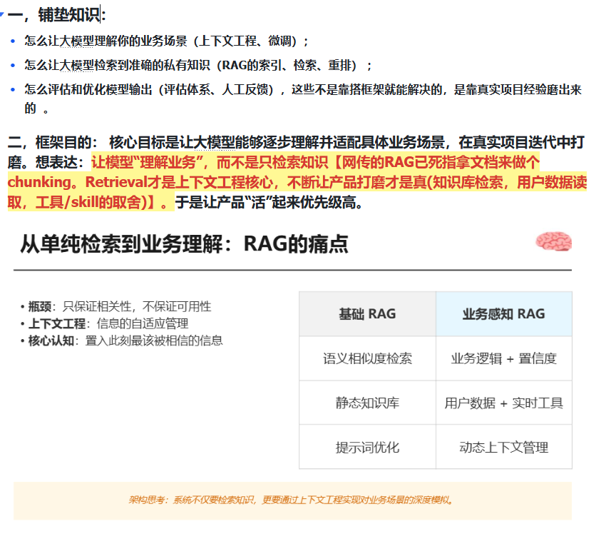
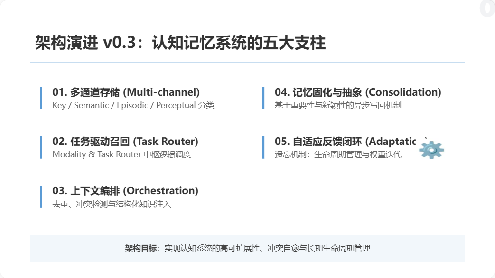
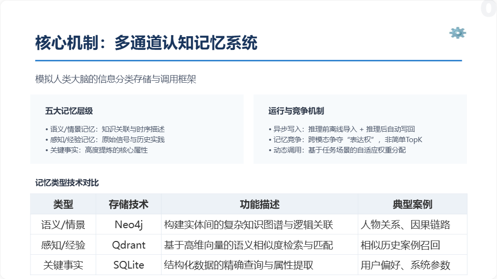
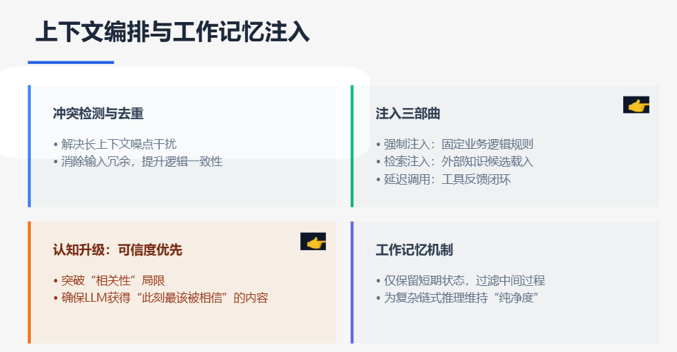

[English](note.en.md) | [中文](note.md)

- Low-code platforms such as Coze often stop at native RAG.
- Standard RAG usually focuses only on knowledge bases.
- Practical systems still need stronger business understanding, retrieval refinement, and real-world feedback loops.

## Preface: the core weakness is not “finding an answer”, but “solving the answer”

This framework focuses on two things:

- understanding the business context
- compensating for the model's built-in tendency to guess instead of truly solving

The hard part in a multi-channel memory system is not score alignment by itself. The real problem is deciding which memory channel should be trusted, and when.

The proposed answer is context engineering:

- treat every input as promptable context
- route different information into different memory channels
- allow one piece of information to enter one or more channels when needed
- let each turn update the right storage path

The high-level mechanism is:

`Understand the task -> classify and retrieve -> fuse across channels -> inject dynamically -> consolidate adaptively -> govern by lifecycle -> tune from feedback`

Another core difficulty is the gap between a clean control path and messy real-world tasks. The solution is to turn generation into a constrained search process rather than a pure free-form response process.

## 1. Why the framework is moving in this direction

The v0.3 direction continues the v0.2 restructuring line and pushes it further toward context engineering.

This design can support:

- CLI-oriented tool products
- coding-agent style products
- multi-agent orchestration systems
- tool-heavy execution systems
- automation workflows in business environments

Local memory channels:

- Semantic Memory: facts and knowledge
- Episodic Memory: historical traces
- Perceptual Memory: perceptual inputs such as OCR, UI states, and logs

Capability channels:

- local CLI tools
- APIs
- MCP tools
- external agents
- remote CLI environments such as SSH, containers, or cloud functions

This direction is also informed by systems such as:

- Claude Code style agent loops
- OpenHarness style execution UIs
- DeerFlow-style multi-agent streaming execution

The long-term issue is still the same symbolic bottleneck: a dynamic world is hard to “solve” unless the solving strategy is tightly coupled with the problem domain itself.

## 2. Five core ideas behind the multi-channel cognitive memory system

The framework turns memory into adaptive information management by making the task and the memory type explicit.

### 2.1 Multi-channel storage

- Store information separately as Key, Semantic, Episodic, Perceptual, Experience, and Sensory Buffer.
- Intuition: different information belongs in different drawers.

### 2.2 Task-driven retrieval and fusion

- Use a Modality and Task Router to determine the type and complexity of the task.
- Retrieve from multiple channels in parallel.
- Rerank inside each channel, then normalize across channels.
- Intuition: multiple specialists contribute, and then their outputs are fused on a shared scale.

### 2.3 Context orchestration and working-memory injection

- Deduplicate, detect conflicts, compress, and structure memory candidates.
- Force-inject critical memory.
- Inject retrieved candidates only when useful.
- Intuition: important conclusions go on the table first, while the rest remains available on demand.

### 2.4 Memory consolidation and abstraction

- Write long-term memory based on importance, novelty, and consistency.
- Apply different lifecycle policies to different channels.
- Intuition: not every note deserves a permanent slot in the core notebook.

### 2.5 Adaptive feedback loop

- Collect feedback.
- Promote or demote memory.
- Adjust channel weights, write thresholds, and retrieval scale over time.
- Intuition: the system learns what is actually useful instead of treating all recalled information equally.

## 3. Expanded storage model

The complete architecture uses several distinct memory layers.

### Key Memory

- High-priority stable facts
- Strongly injected
- Good for durable user preferences, rules, prohibitions, and policy-level constraints

### Semantic Memory

- Facts, concepts, rules, and domain knowledge
- Best suited for “what is true”
- Can be implemented with graph and vector retrieval

### Episodic Memory

- Historical events and task summaries
- Best suited for “what happened”
- More sensitive to recency decay

### Perceptual Memory

- Interpreted perceptual signals from images or multimodal inputs
- Best suited for “what was seen”
- Stronger decay and shorter retention are often appropriate

### Experience Memory

- Reusable success paths, failure cases, and repair strategies
- Best suited for “what should we do next time”
- One of the main sources of system growth

### Working Memory

- Recent turns, current task state, and active context
- Used only for short-term reasoning

### Sensory Buffer

- Raw perceptual clues with short TTL
- Prevents the system from permanently memorizing every raw signal

### Forget Lifecycle Layer

- Governs retention, demotion, summarization, archive, and deletion
- Uses fields such as recency, access counts, use counts, pinning, and decay

## 4. Operational flow

The runtime loop can be summarized as:

1. Input enters the system and is normalized into a structured raw object.
2. The task router determines task type, modality, complexity, and candidate channels.
3. For multimodal inputs, raw signals first enter the sensory buffer.
4. Key memory is fetched directly.
5. Other long-term memory channels retrieve candidates in parallel.
6. Retrieved candidates are touched for lifecycle bookkeeping.
7. Each channel reranks internally.
8. Cross-channel scores are normalized.
9. Task-aware fusion selects the final memory set.
10. The context orchestrator deduplicates, resolves or marks conflicts, compresses, and structures memory.
11. Long-term memory that truly enters the context is touched again as “used”.
12. Working memory is built for the current reasoning turn.
13. The LLM or agent executes, optionally through tool loops.
14. After the final answer, the post-run router decides what is worth remembering.
15. Memory candidates are consolidated into Key, Semantic, Episodic, Perceptual, or Experience memory.
16. Writes happen asynchronously.
17. Lifecycle governance and feedback tuning improve future retrieval and write behavior.

## 5. Why this is not “just another RAG layer”

The target system is not:

`See information -> store everything -> retrieve later`

Instead, the target system is:

`Understand the task -> buffer perception -> retrieve in parallel -> fuse across channels -> orchestrate context -> execute -> decide what is worth remembering -> consolidate into typed long-term memory -> govern by lifecycle -> keep tuning from feedback`

That is what turns the system into an adaptive cognitive memory framework with:

- learning capability
- lifecycle management
- long-term evolvability

## 6. Note on the swimlane diagram

The original Chinese note includes the detailed swimlane diagram and the text-based swimlane supplement.

This English note intentionally omits the translated swimlane block for now.

If needed later, the image set can be localized separately and versioned as English visual assets instead of mixed-language screenshots.
